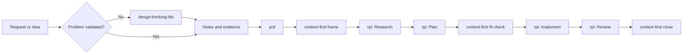

## Decision

We will use [Awesome Copilot](https://github.com/github/awesome-copilot) as
the distribution and runtime surface for our workflow. We will not make
[HVE Core](https://github.com/microsoft/hve-core) a required dependency.

We will contribute or maintain a `context-first` plugin that packages the
session loop, the Research, Plan, Implement, and Review lifecycle, and the
requirements artifacts as reusable skills. Discovery and PRD authoring are
separate skills so that ambiguous customer work has an explicit route without
imposing that overhead on bounded engineering work.

The package must preserve the workflow controls that matter: evidence-based
research, explicit acceptance criteria, scoped implementation, independent
review, durable records, and clear follow-up routing. It must not copy HVE Core
verbatim or inherit its extension-specific mechanisms.

> [!IMPORTANT]
> Source artifacts must be owned, reviewed, versioned, and validated by our
> team. HVE Core may be used as a reference for patterns, not as an installation
> dependency or runtime requirement.

## Target Architecture



## Skills in This Repository

| Skill | Responsibility | Location |
|-------|----------------|----------|
| `context-first` | Session outer loop: frame, fit check, and close ritual ending in a tagged release | [skills/context-first/SKILL.md](skills/context-first/SKILL.md) |
| `rpi` | Research, Plan, Implement, Review inner loop, with per-phase constraints and artifacts | [skills/rpi/SKILL.md](skills/rpi/SKILL.md) |
| `design-thinking-lite` | Validates the real problem before anything is built, and hands off evidence-backed requirements | [skills/design-thinking-lite/SKILL.md](skills/design-thinking-lite/SKILL.md) |
| `prd` | Builds a PRD from stream-of-consciousness notes, with cited provenance and an explicit gap list | [skills/prd/SKILL.md](skills/prd/SKILL.md) |

Bundled assets:

| Asset | Used by |
|-------|---------|
| [session-log-template.md](skills/context-first/assets/session-log-template.md) | `context-first` close ritual and health signals |
| [prd-template.md](skills/prd/assets/prd-template.md) | `prd` output structure, including deliberate underspecification |

## Planned Artifacts

| Artifact | Responsibility | Planned form |
|----------|----------------|--------------|
| `context-first` plugin | Groups the maintained skills for installation | `plugins/context-first/plugin.json` |

Each skill stands on its own and composes with the others. `rpi` runs standalone
for a single task. `context-first` wraps it with the session frame, the fit
check, and the close ritual. `prd` feeds it scope and acceptance criteria, and
`design-thinking-lite` feeds `prd` when the problem itself is unvalidated. No
skill requires the others to be installed.

Discovery stays a separate install from the session loop until evidence shows
every team needs it. That keeps bounded engineering work low-friction while
giving ambiguous customer work an explicit route.

## Selective Installer

Provide a repository-owned installer at `scripts/install-awesome-copilot-rpi.sh`
and a PowerShell equivalent at `scripts/Install-AwesomeCopilotRpi.ps1`. The
installer uses the GitHub CLI to download only the allowlisted artifacts selected
by a profile, then writes them into the consuming repository's `.github/`
directory.

Supported initial profiles:

| Profile | Installed artifacts | Intended use |
|---------|---------------------|--------------|
| `rpi` | `rpi` alone | A single non-trivial task, without the session loop |
| `session` | `context-first`, `rpi`, and `prd` | Engineering teams with settled requirements |
| `discovery` | `design-thinking-lite` and `prd` | Customer discovery, workshops, and ambiguous requests |
| `full` | All four skills | Discovery that continues into delivery |
| `governed` | `full` plus organization-approved instructions | Teams that require prescribed engineering or security standards |

The installer must:

1. Require `gh` and an authenticated GitHub session.
2. Require `--ref <tag-or-full-sha>` and reject an unpinned branch such as `main`.
3. Download every selected artifact with `gh api repos/<owner>/<repo>/contents/<path>?ref=<ref>`.
4. Enforce a hard-coded allowlist of paths and reject traversal or unrecognized selections.
5. Validate that each downloaded skill has a matching `name` in `SKILL.md` frontmatter.
6. Write an installation manifest containing the source repository, immutable ref,
	selected profile, artifact paths, and file hashes.
7. Support `--dry-run`, `--force`, and `--verify` so teams can review, update, and
	validate installations predictably.
8. Never execute downloaded content during installation and never use `curl | bash`.

Example consumer usage after the package is published and tagged:

```bash
gh repo clone <our-org>/copilot-rpi
cd copilot-rpi
./scripts/install-awesome-copilot-rpi.sh \
  --target ../customer-repository \
  --profile full \
  --ref v1.0.0
```

## Delivery Plan

| Step | Work | Status |
|------|------|--------|
| 1 | Author the `context-first` session skill and session log template | Done |
| 2 | Author the `design-thinking-lite` discovery skill | Done |
| 3 | Author the `prd` skill and PRD template | Done |
| 4 | Author the `rpi` skill as a standalone inner loop that other skills leverage | Done |
| 5 | Build the Bash and PowerShell selective installers with the controls above | Next |
| 6 | Test installation from a release tag into an empty fixture repository, and verify each skill is discoverable by GitHub Copilot | Not started |
| 7 | Package the artifacts as a plugin and submit through the Awesome Copilot validation and contribution workflow, or host it as an independently versioned plugin | Not started |
| 8 | Pilot with one delivery team and measure time to a validated plan, implementation rework, review findings, and installer success rate | Not started |

## Copilot Training

## I would like you to consider three sets of content / courses:

1.	Deep dive (3-4 hours recording). Target audience: GSIs. The goal is to teach what you covered the first morning of the HVE Workshop (What is it? Why? Our methodology approach & design thinking, best practices (e.g. shifting security and governance to the left / early stages), how to install it? how to use it?

2.	Rapid Prototyping (2-3 hours). Target audience: SI in multi-partner events. I have been told Judson is looking for ways to make our sellers and partners more effective on delivering business value faster to customers.  Sales teams are creating Technical Workshop and proposing the Windows Whiteboard app to identify and capture requirements then use screen shots to ask GitHub Copilot to generate a prototype. Here HVE will provide a better way to solve the right problem and capture/communicate/share requirements (e.g. PRD)

3.	Full course delivery (8-12 hours). Target audience: GSI requesting private deliveries beyond your scope. We have instructors that can deliver the materias you use for HVE workshops. If needed our suppliers can hire MVPs to ensure the instructor delivering the workshop has real-world experience and they are not theoretical educators.
