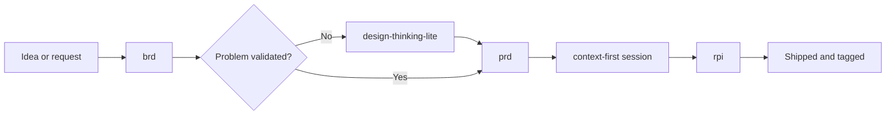

## Overview

Reusable GitHub Copilot skills for AI-native engineering. Each skill is a
self-contained markdown package that works on its own and composes with the
others, covering the path from business case to discovery, requirements, and
delivery.

The skills are owned, reviewed, and versioned here. They draw on published
patterns but do not depend on any framework at runtime.

## Skills in This Repository

| Skill | Responsibility | Location |
|-------|----------------|----------|
| `brd` | Builds a business requirements document from notes, covering objectives, measures, scope, and risks | [skills/brd/SKILL.md](skills/brd/SKILL.md) |
| `context-first` | Session outer loop: frame, fit check, and close ritual ending in a tagged release | [skills/context-first/SKILL.md](skills/context-first/SKILL.md) |
| `design-thinking-lite` | Validates the real problem before anything is built, and hands off evidence-backed requirements | [skills/design-thinking-lite/SKILL.md](skills/design-thinking-lite/SKILL.md) |
| `prd` | Builds a PRD from stream-of-consciousness notes, with cited provenance and an explicit gap list | [skills/prd/SKILL.md](skills/prd/SKILL.md) |
| `rpi` | Research, Plan, Implement, Review inner loop, with per-phase constraints and artifacts | [skills/rpi/SKILL.md](skills/rpi/SKILL.md) |

Bundled assets:

| Asset | Used by |
|-------|---------|
| [brd-template.md](skills/brd/assets/brd-template.md) | `brd` output structure |
| [session-log-template.md](skills/context-first/assets/session-log-template.md) | `context-first` close ritual and health signals |
| [prd-template.md](skills/prd/assets/prd-template.md) | `prd` output structure, including deliberate underspecification |

## How They Fit Together

Start at the skill that owns the next real decision. A bounded engineering task
needs only `rpi`. A settled requirement needs `context-first` and `rpi`. An
ambiguous customer request starts further left.

## Documentation

| Document | Contents |
|----------|----------|
| [docs/design.md](docs/design.md) | Distribution decision, target architecture, installer requirements, and delivery status |
| [docs/training-brief.md](docs/training-brief.md) | Raw stakeholder request for Copilot training offerings, pending a BRD |

## License

MIT. See [LICENSE](LICENSE).
