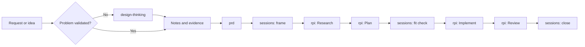

## Approach

We use the GitHub CLI skills command, the same mechanism
[Awesome Copilot](https://github.com/github/awesome-copilot) uses to distribute
its catalog. This is a choice of plumbing, not a dependency on a catalog or a
framework. Skills are markdown packages that install into a repository, so teams
can reuse published skills, edit them, and author their own on the same footing.
That authorability is the point: a skill someone cannot change is a framework
with extra steps.

Like [HVE Core](https://github.com/microsoft/hve-core), we subscribe to Design
Thinking and RPI. We implement both differently. HVE Core targets a chat-centric
workflow, while these skills target agents, so each phase carries its own
constraints and produces its own artifacts rather than running as a sequence of
chat prompts.

PRDs and BRDs are not novel. They are used frequently across AI-assisted software
engineering, and they are included here because requirements work is where most
delivery failures start. The variation worth noting is that both are built from
written notes with cited provenance, rather than assembled through an interview.

`sessions` came out of our experience working with GSIs and enterprise customers.
The recurring problem there was not generation speed. It was work that never
closed: scope drift, unmerged branches, and every session starting cold.

## Naming

This effort needs a name and does not have one yet. Treat every occurrence of
`new-method` in this repository as a placeholder to be replaced once the name is
settled.

Constraints:

* HVE is not available. That team retains the HVE name and charter.
* `context-first` is a candidate, but it is currently a separate effort. Adopting
  it now would conflate two things that are not yet the same thing, and would
  claim a name we do not own.

The name reaches further than a rename usually implies. It appears in the
repository name, the plugin identity, the installer script names, document
titles, and any course material that references them. Settling it early costs
less than settling it after the first delivery.

Attribution is separate from naming. Credits that reference `context-first` or
HVE Core cite the source of a methodology and stay as they are regardless of what
this effort ends up being called.

## Install Skills In the Repository

Skills belong inside the repository they serve, not in a user-level or
extension-managed location outside it. HVE Core installs outside the repository,
and we take the opposite position deliberately.

In-repo installation gives a team two things it otherwise gives up:

* Customization. A skill in the repository can be edited to match how this team
  actually works. A skill installed elsewhere is read-only in practice, so local
  knowledge accumulates outside the workflow instead of inside it.
* Version control. The team decides when a skill changes, reviews the diff, and
  ships it with the code it governs. An externally managed skill can change
  underneath a repository without a commit, which makes behavior unreproducible
  across machines and over time.

The practical test is whether checking out an old commit reproduces the workflow
that was in force at the time. That only holds when the skills live with the code.

## Use Language-Scoped Instructions

GitHub Copilot applies instructions by file pattern, so guidance can attach to
`*.go`, `*.ts`, `*.cs`, or any other glob. That capability is distinctive and
underused, and it should be both taught and used in what we build.

It matters because scoping changes what the model sees. Language guidance that
loads only when a matching file is open keeps context focused, and it lets a
polyglot repository carry conventions per language without one set of standards
bleeding into another.

HVE Core does ship language-specific content. Our read is that much of it is
dated and verbose for current models, which are stronger at idiomatic code than
they were when that material was written. The useful content is the part a model
still gets wrong without being told: local conventions, house style, and the
specific traps in this codebase. Write that and leave out the general language
tutorial.

## Composition

Every skill is optional, and each one is useful on its own. Skills may use other
skills:

| Skill | Uses | Standalone behavior |
|-------|------|---------------------|
| `sessions` | `rpi` for the inner loop | Falls back to inline per-phase prompts |
| `prd` | Discovery output when it exists | Drafts from whatever notes are available |
| `design-thinking` | Nothing | Hands off notes and evidence |
| `brd` | Nothing | Drafts from stakeholder notes |
| `rpi` | Nothing | Runs a single task end to end |

No skill requires another to be installed. Install the one that owns the next
decision and add others when they earn their place.

The set preserves the workflow controls that matter: evidence-based research,
explicit acceptance criteria, scoped implementation, independent review, durable
records, and clear follow-up routing.

> [!IMPORTANT]
> Source artifacts are owned, reviewed, versioned, and validated by our team.
> HVE Core is a reference for patterns, not an installation dependency or a
> runtime requirement.

## Target Architecture



Discovery stays a separate install from the session loop until evidence shows
every team needs it. That keeps bounded engineering work low-friction while
giving ambiguous customer work an explicit route.

See the [skills catalog](../README.md#skills-in-this-repository) for what exists today.

## Planned Artifacts

| Artifact | Responsibility | Planned form |
|----------|----------------|--------------|
| `new-method` plugin | Groups the maintained skills for installation | `plugins/new-method/plugin.json` |

## Selective Installer

Provide a repository-owned installer at `scripts/install-awesome-copilot-rpi.sh`
and a PowerShell equivalent at `scripts/Install-AwesomeCopilotRpi.ps1`. The
installer uses the GitHub CLI to download only the allowlisted artifacts selected
by a profile, then writes them into the consuming repository's `.github/`
directory.

Supported initial profiles:

| Profile | Installed artifacts | Intended use |
|---------|---------------------|--------------|
| `rpi` | `rpi` alone | A single non-trivial task, without the session loop |
| `session` | `sessions`, `rpi`, and `prd` | Engineering teams with settled requirements |
| `discovery` | `design-thinking`, `brd`, and `prd` | Customer discovery, workshops, and ambiguous requests |
| `full` | All five skills | Discovery that continues into delivery |
| `governed` | `full` plus organization-approved instructions | Teams that require prescribed engineering or security standards |

The installer must:

1. Require `gh` and an authenticated GitHub session.
2. Require `--ref <tag-or-full-sha>` and reject an unpinned branch such as `main`.
3. Download every selected artifact with `gh api repos/<owner>/<repo>/contents/<path>?ref=<ref>`.
4. Enforce a hard-coded allowlist of paths and reject traversal or unrecognized selections.
5. Validate that each downloaded skill has a matching `name` in `SKILL.md` frontmatter.
6. Write an installation manifest containing the source repository, immutable ref,
   selected profile, artifact paths, and file hashes.
7. Support `--dry-run`, `--force`, and `--verify` so teams can review, update, and
   validate installations predictably.
8. Never execute downloaded content during installation and never use `curl | bash`.
9. Merge rather than overwrite when updating a skill that has been modified
   locally, using the ref recorded in the manifest as the merge base. See
   [Updating Installed Skills](#updating-installed-skills).

Example consumer usage after the package is published and tagged:

```bash
gh repo clone <our-org>/copilot-rpi
cd copilot-rpi
./scripts/install-awesome-copilot-rpi.sh \
  --target ../customer-repository \
  --profile full \
  --ref v1.0.0
```

## Updating Installed Skills

In-repo installation buys customization and reproducibility, and it pays for
both with drift. A skill a team can edit is a skill that will diverge from
upstream. That is the intended trade, not a defect, but it only stays a good
trade if updating is a defined ritual rather than an overwrite.

Treat installed skills as vendored, not subscribed. Nothing updates on its own,
and no update lands without a diff someone read.

### Release Contract

Consumers can only pin to what we publish, so the publishing side comes first.

* Tags are immutable. A wrong `v1.0.0` is fixed by `v1.0.1`, never by moving the
  tag. A moved tag invalidates every manifest hash downstream and destroys the
  reproducibility this whole approach rests on.
* Version the skill set, not each skill. Patch is wording, minor is a new skill
  or a new optional step, major is a renamed skill, a moved path, or a changed
  template structure.
* Artifact paths and the `name` in `SKILL.md` frontmatter are the public API.
  The installer allowlist and its frontmatter validation both key on them, so
  moving or renaming either is a breaking change.
* Sign release tags. It is the answer when a customer asks how they know the
  skill they installed is the one we published.
* Keep a changelog that names which sections of a skill changed, not only which
  files. A team that edited a skill locally needs to know what to re-read.

### Update Cadence

Update on project milestones, not on a calendar. An automatic weekly bump
changes agent behavior mid-session, which is the same unreproducibility we
reject for externally managed installs.

| Trigger | Action |
|---------|--------|
| Start of a project or engagement | Install the current release, pinned |
| Between phases, such as discovery closing and delivery opening | Update if the profile needs to change |
| A `sessions` close where a skill visibly misfired | Update, or fix locally and consider upstreaming |
| A new upstream major | Read the changelog and schedule the merge deliberately |
| Mid-session, mid-cohort, or mid-release | Do not update |

Record the installed ref in the session log entry. `sessions` already ends in a
tag and a written paragraph, so adding the ref makes "which methodology version
produced this release" answerable from git alone.

### Detecting Drift

`--verify` re-hashes installed files against the manifest. The three results it
can return are three different pieces of work.

| State | Meaning | Action |
|-------|---------|--------|
| Clean | Files match the manifest hashes | Update to the new ref, review the diff, commit |
| Locally modified | The team edited the skill | Three-way merge, using the manifest ref as the base |
| Upstream-only change | New release, files untouched locally | Update as clean, and read the changelog for behavior changes |

### Merging Local Edits

`--force` over a locally customized skill destroys exactly the local knowledge
that in-repo installation exists to capture. The installer must offer a real
three-way merge instead, and it already holds everything required: the manifest
names the base ref, `gh api` fetches that base revision, and `git merge-file`
resolves against the new one.

At merge time, sort every local edit into one of two kinds:

* Project-specific. Codebase traps, house conventions, and the language-scoped
  guidance described above. These stay local permanently and are re-applied on
  every update.
* Generally useful. If several teams made the same edit, it belongs upstream.
  Open a pull request here, then drop the local change once it ships.

Skipping that sort is how a fork widens on every cycle until updating stops
being worth attempting.

### Pinning for Course Delivery

Freeze the ref for the duration of a cohort. The lab repository, the known-good
PRD, and the run sheet timings are all coupled to specific skill wording, so an
upstream update mid-course invalidates the instructor kit.

This also answers an open question in the [training
brief](training-brief.md#course-1-open-questions): whoever cuts a major version
owns refreshing the recorded and printed material, and courses pin to a tag
until that refresh ships.

## Delivery Plan

| Step | Work | Status |
|------|------|--------|
| 1 | Author the `sessions` skill and session log template | Done |
| 2 | Author the `design-thinking` discovery skill | Done |
| 3 | Author the `prd` skill and PRD template | Done |
| 4 | Author the `rpi` skill as a standalone inner loop that other skills leverage | Done |
| 5 | Author the `brd` skill and BRD template | Done |
| 6 | Build the Bash and PowerShell selective installers with the controls above | Next |
| 7 | Cut and sign the first release tag and start the changelog, so there is a pinnable ref to install from | Not started |
| 8 | Test installation from a release tag into an empty fixture repository, and verify each skill is discoverable by GitHub Copilot | Not started |
| 9 | Test the update path against that fixture, covering a clean update, a locally modified skill, and a rejected unpinned ref | Not started |
| 10 | Package the artifacts as a plugin and submit through the Awesome Copilot validation and contribution workflow, or host it as an independently versioned plugin | Not started |
| 11 | Pilot with one delivery team and measure time to a validated plan, implementation rework, review findings, and installer success rate | Not started |
