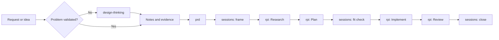

## Approach

We use the GitHub CLI skills command, the same mechanism
[Awesome Copilot](https://github.com/github/awesome-copilot) uses to distribute
its catalog. This is a choice of plumbing, not a dependency on a catalog or a
framework. Skills are markdown packages that install into a repository, so teams
can reuse published skills, edit them, and author their own on the same footing.
That authorability is the point: a skill someone cannot change is a framework
with extra steps.

Like [HVE Core](https://github.com/microsoft/hve-core), we subscribe to Design
Thinking and RPI. We implement both differently. HVE Core targets a chat-centric
workflow, while these skills target agents, so each phase carries its own
constraints and produces its own artifacts rather than running as a sequence of
chat prompts.

PRDs and BRDs are not novel. They are used frequently across AI-assisted software
engineering, and they are included here because requirements work is where most
delivery failures start. The variation worth noting is that both are built from
written notes with cited provenance, rather than assembled through an interview.

`sessions` came out of our experience working with GSIs and enterprise customers.
The recurring problem there was not generation speed. It was work that never
closed: scope drift, unmerged branches, and every session starting cold.

## Composition

Every skill is optional, and each one is useful on its own. Skills may use other
skills:

| Skill | Uses | Standalone behavior |
|-------|------|---------------------|
| `sessions` | `rpi` for the inner loop | Falls back to inline per-phase prompts |
| `prd` | Discovery output when it exists | Drafts from whatever notes are available |
| `design-thinking` | Nothing | Hands off notes and evidence |
| `brd` | Nothing | Drafts from stakeholder notes |
| `rpi` | Nothing | Runs a single task end to end |

No skill requires another to be installed. Install the one that owns the next
decision and add others when they earn their place.

The set preserves the workflow controls that matter: evidence-based research,
explicit acceptance criteria, scoped implementation, independent review, durable
records, and clear follow-up routing.

> [!IMPORTANT]
> Source artifacts are owned, reviewed, versioned, and validated by our team.
> HVE Core is a reference for patterns, not an installation dependency or a
> runtime requirement.

## Target Architecture



Discovery stays a separate install from the session loop until evidence shows
every team needs it. That keeps bounded engineering work low-friction while
giving ambiguous customer work an explicit route.

See the [skills catalog](../README.md#skills-in-this-repository) for what exists today.

## Planned Artifacts

| Artifact | Responsibility | Planned form |
|----------|----------------|--------------|
| `context-first` plugin | Groups the maintained skills for installation | `plugins/context-first/plugin.json` |

## Selective Installer

Provide a repository-owned installer at `scripts/install-awesome-copilot-rpi.sh`
and a PowerShell equivalent at `scripts/Install-AwesomeCopilotRpi.ps1`. The
installer uses the GitHub CLI to download only the allowlisted artifacts selected
by a profile, then writes them into the consuming repository's `.github/`
directory.

Supported initial profiles:

| Profile | Installed artifacts | Intended use |
|---------|---------------------|--------------|
| `rpi` | `rpi` alone | A single non-trivial task, without the session loop |
| `session` | `sessions`, `rpi`, and `prd` | Engineering teams with settled requirements |
| `discovery` | `design-thinking`, `brd`, and `prd` | Customer discovery, workshops, and ambiguous requests |
| `full` | All five skills | Discovery that continues into delivery |
| `governed` | `full` plus organization-approved instructions | Teams that require prescribed engineering or security standards |

The installer must:

1. Require `gh` and an authenticated GitHub session.
2. Require `--ref <tag-or-full-sha>` and reject an unpinned branch such as `main`.
3. Download every selected artifact with `gh api repos/<owner>/<repo>/contents/<path>?ref=<ref>`.
4. Enforce a hard-coded allowlist of paths and reject traversal or unrecognized selections.
5. Validate that each downloaded skill has a matching `name` in `SKILL.md` frontmatter.
6. Write an installation manifest containing the source repository, immutable ref,
   selected profile, artifact paths, and file hashes.
7. Support `--dry-run`, `--force`, and `--verify` so teams can review, update, and
   validate installations predictably.
8. Never execute downloaded content during installation and never use `curl | bash`.

Example consumer usage after the package is published and tagged:

```bash
gh repo clone <our-org>/copilot-rpi
cd copilot-rpi
./scripts/install-awesome-copilot-rpi.sh \
  --target ../customer-repository \
  --profile full \
  --ref v1.0.0
```

## Delivery Plan

| Step | Work | Status |
|------|------|--------|
| 1 | Author the `sessions` skill and session log template | Done |
| 2 | Author the `design-thinking` discovery skill | Done |
| 3 | Author the `prd` skill and PRD template | Done |
| 4 | Author the `rpi` skill as a standalone inner loop that other skills leverage | Done |
| 5 | Author the `brd` skill and BRD template | Done |
| 6 | Build the Bash and PowerShell selective installers with the controls above | Next |
| 7 | Test installation from a release tag into an empty fixture repository, and verify each skill is discoverable by GitHub Copilot | Not started |
| 8 | Package the artifacts as a plugin and submit through the Awesome Copilot validation and contribution workflow, or host it as an independently versioned plugin | Not started |
| 9 | Pilot with one delivery team and measure time to a validated plan, implementation rework, review findings, and installer success rate | Not started |
